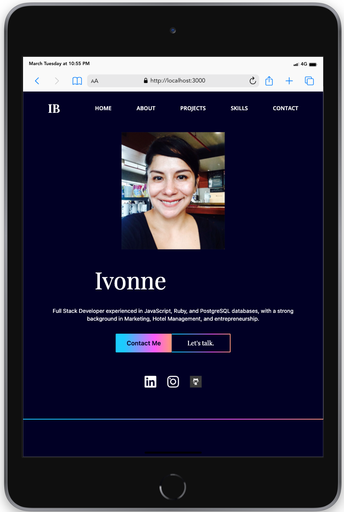
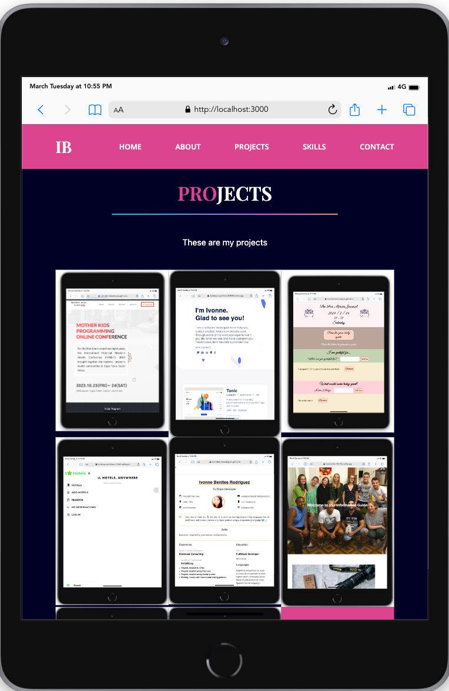
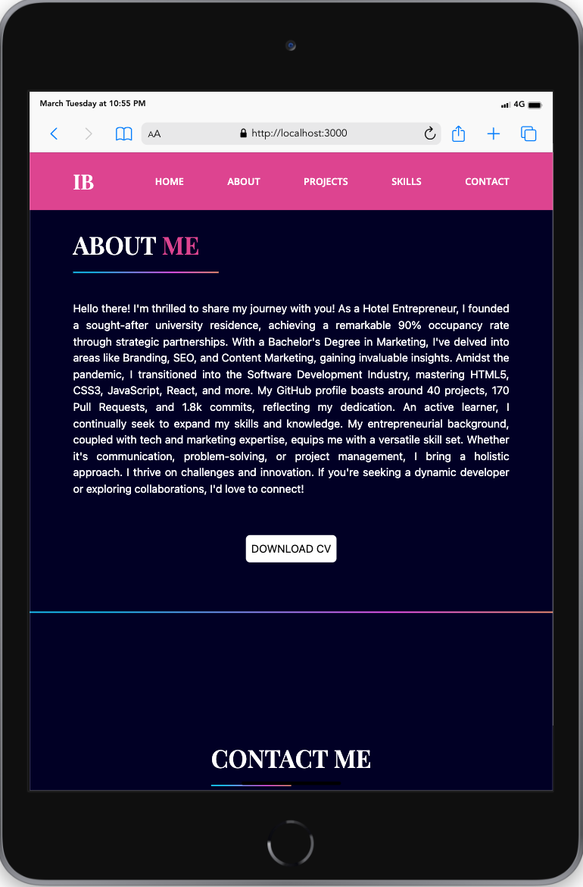
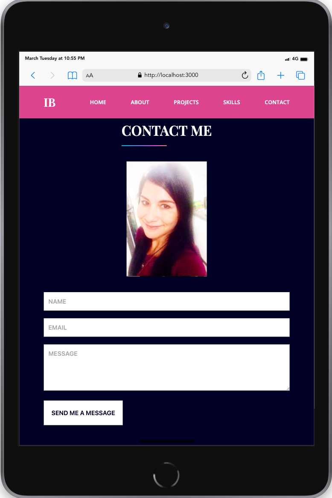

# Please visit my Portfolio 🌷
<div align="center">
  <h1>Responsive Project-ipad Mini version</h1>
  
  
  
  
</div>
# 📗 Table of Contents

- [Please visit my Portfolio 🌷](#please-visit-my-portfolio-)
- [📗 Table of Contents](#-table-of-contents)
- [📖 My Portfolio](#-my-portfolio)
  - [🛠Live Demo](#live-demo)
  - [🛠 Built With ](#-built-with-)
    - [Tech Stack ](#tech-stack-)
    - [Key Features 🌷 ](#key-features--)
    - [Setup](#setup)
    - [Install](#install)
    - [Usage](#usage)
  - [👥 Author ](#-author-)
  - [🔭 Future Features ](#-future-features-)
  - [🤝 Contributing ](#-contributing-)
  - [⭐️ Show your support ](#️-show-your-support-)
  - [🙏 Acknowledgments ](#-acknowledgments-)
  - [📝 License ](#-license-)

# 📖 My Portfolio<a name="about-project">
This project is about building my portfolio in desktop and mobile version.
I used React and tailwind as libraries, as well as vercel for the deployment.
</a>

## 🛠Live Demo
[Live Demo](https://portfolio-ivonne-benites.vercel.app/)

## 🛠 Built With <a name="built-with"></a>

### Tech Stack <a name="tech-stack"></a>

<details>
  <summary>Client 🌷</summary>
    <ul>
    <li><a href="https://react.dev/">React</a></li>
  </ul>
</details>
<details>
  <summary>For Styling: 🌷</summary>
    <ul>
    <li><a href="https://tailwindcss.com/">Tailwind</a></li>
  </ul>
</details>


### Key Features 🌷 <a name="key-features"></a>

Feature : Separation of Concerns principle used in this project.

<p align="right">(<a href="#readme-top">back to top</a>)</p>

### Setup

Clone this repository to your desired folder:

```sh
cd my-prefered-folder
  
git clone https://github.com/IvonneBenitesRodriguez/portfolio_ivonne_benites.git

```

### Install

Install this project with:

```sh
cd portfolio_ivonne_benites
  
npm init -y
npm install
```

### Usage

To run the project run the following commands:

```sh
npm start 
```
<p align="right">(<a href="#readme-top">back to top</a>)</p>

## 👥 Author <a name="author"></a>

👤 **Ivonne Benites**

- 🌷GitHub: [@githubhandle](https://github.com/IvonneBenitesRodriguez)
- 🌷Twitter: [@twitterhandle](https://twitter.com/IvonneBenitesR)
- 🌷LinkedIn: [LinkedIn](https://www.linkedin.com/in/ivonnebenites/)
  
<p align="right">(<a href="#readme-top">back to top</a>)</p>

## 🔭 Future Features <a name="future-features"></a>

- [ ] **Add experience section**

<p align="right">(<a href="#readme-top">back to top</a>)</p>

## 🤝 Contributing <a name="contributing"></a>

Contributions, issues, and feature requests are welcome!

Feel free to check the [issues page](https://github.com/IvonneBenitesRodriguez/portfolio_ivonne_benites/issues).

<p align="right">(<a href="#readme-top">back to top</a>)</p>

## ⭐️ Show your support <a name="support"></a>

If you like this project please give it a star 😁🌟✨

<p align="right">(<a href="#readme-top">back to top</a>)</p>

## 🙏 Acknowledgments <a name="acknowledgements"></a>

I would like to thank to Microverse for all the support and opportunity.

<p align="right">(<a href="#readme-top">back to top</a>)</p>

## 📝 License <a name="license"></a>

This project is [MIT](./LICENSE) licensed.

<p align="right">(<a href="#readme-top">back to top</a>)</p>

